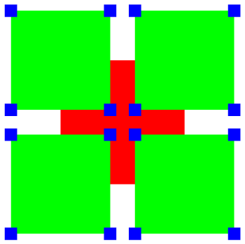

# Quilting Bee
## Using Quilting Bee
- run ```pip install -r dependencies.txt``` in terminal. These dependencies have been tested on Linux and Windows.
- run ```py QuiltingBee.py``` in terminal.
## Notes on the Implementation
- This version of Quilting Bee gives you the option to enter your wanted scale and RGB values in terminal or to use the 'GUI' command to get a better colour selector.
- Further more it utilises a recursive method to draw squares on the corners of all of the squares.
## Intro
The YGQA(A-M) are considering a new design to welcome the Century of the Anchovy (a few years late).
"We should start with a big central square"
“And then other, smaller squares of a different colour, centred at its corners”
“And more, at their corners, and more at theirs, and . . . ”
Like Nanny Ogg and her spelling of banananana, the YGQA(A-M) are clear about how
to start, but not quite about where to stop.
Of the Twilight the Darkness drew up an example with three layers, red, green and
blue, with the green squares 80% as big as the red one (in linear dimensions), and the
blue ones 10% as big as the red one.

Predictably, it did not meet with universal approval. So the YGQA(A-M) have ap-
proached you to produce a way of examining other possibilities easily.

## Task
Write a program that produces a representation of a quilt design on the screen or as a
graphics file in a common format. The input to the program will be a sequence of lines
of the form:
```scale r g b```
where scale is a scale parameter for the current layer, and r g b are values from 0-
255 representing red, green and blue levels in the RGB scale. For instance, the example
above could be produced from input:
```1.0 255 0 0```
```0.8 0 255 0```
```0.1 0 0 255```
Note that some radical members of the YGQA(A-M) do not necessarily agree that later
squares need to be smaller than earlier ones, nor that the first square necessarily has a
scale parameter of 1.0. Part of your problem is to ensure that whatever scale parameters
are given, your representation fits, and nearly fills, a reasonably sized window (or on a
single page if using a graphics file).
Input should be taken from stdin, or (if you are using some sort of a GUI) by pasting
the entire sequence of lines into a text component. That is, it should not be necessary to
enter the lines or values one at a time.

## Standards
For an achieved standard the program must operate as specified.
Merit criteria include well-structured and readable code, and some flexibility in the
program’s use (e.g., supporting multiple output formats).
Excellence criteria include some significant extension to the functionality or scope of
the program.